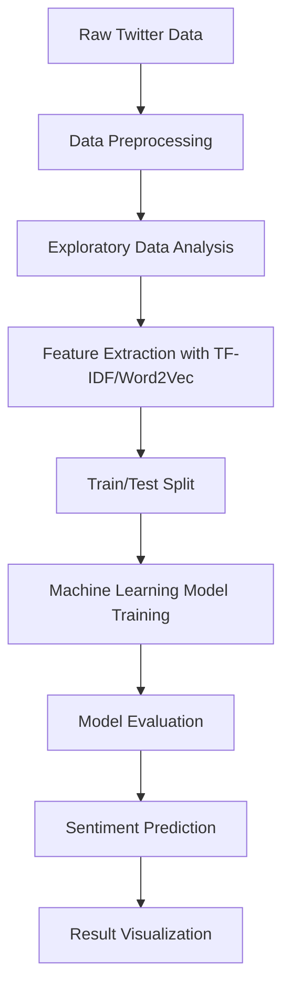

# 📊 Sentiment Analysis on Twitter Data

This project is focused on analyzing the sentiment of Twitter data using machine learning techniques. The aim is to classify tweets as positive, negative, or neutral by leveraging natural language processing (NLP) and machine learning algorithms.

---

## 🚀 Features

- Preprocessing of Twitter data (removing stop words, punctuation, etc.).
- Implementation of various machine learning models such as Logistic Regression, SVM, and Random Forest.
- Evaluation metrics like accuracy, precision, recall, and F1-score.
- Visualization of sentiment distribution.

---

## 📂 Project Structure

```plaintext
Sentiment_Analysis_Twitter_Data/
├── train.csv                                   # Raw and cleaned datasets
├── Sentiment_Analysis_Twitter.ipynb            # Jupyter notebooks for exploratory analysis and model development
├── Sentiment_Analysis_Twitter.ipynb            # Source code for preprocessing, modeling, and evaluation
├── results/                                    # Model evaluation results and visualizations
└── README.md                                   # Project documentation
```

---

## 🛠️ Installation

1. Clone the repository:
   ```bash
   git clone https://github.com/SanthoshkumarSundararaj/Sentiment_Analysis_Twitter_Data.git
   ```
2. Navigate to the project directory:
   ```bash
   cd Sentiment_Analysis_Twitter_Data
   ```

---

## 📊 Workflow



---

## 🖥️ Usage

1. Run the jupyter cells one by one in the file Sentiment_Analysis_Twitter.ipynb


---

## 🔍 Results

- Sentiment distribution of tweets.
- Performance metrics of each machine learning model.
- Confusion matrices for better insights.

---

## ✨ Acknowledgments

Special thanks to the NLP and data science community for their resources and inspiration.

---

## 🙋‍♂️ Contributions

Contributions are welcome! Feel free to open issues or submit pull requests to improve the project.
